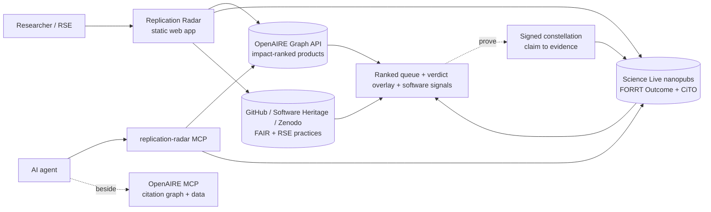

# OpenAIRE AI Hackathon — Submission draft (Replication Radar)

> Working draft to paste into the official template and email to innovation@openaire.eu by **20 Aug 2026, 23:59 CET**. Word limits noted per section. `[FILL: …]` marks things only Anne can supply. Numbering matches the template.

**One line:** *Replication Radar turns the OpenAIRE Graph into a replication radar — surfacing what's already been independently checked, what's most worth replicating next, and the reusable software and data to do it.*

---

## 0. Submission Details
- **Title:** Replication Radar: Find What's Been Checked, What's Worth Replicating, and How to Replicate It
- **Theme:** B (Build)
- **Applicant / team name:** Science Live Team
- **Type:** Team (3 people)
- **Country:** Norway (contact — VitenHub AS); distributed team across **Norway** (Jean), **UK** (Saranjeet) and **Spain** (Anne)
- **Contact person:** Jean Iaquinta (VitenHub AS) · jiaquinta@vitenhub.no

  | Name | Role | Affiliation | ORCID |
  |---|---|---|---|
  | Anne Fouilloux | Build: Radar web app + MCP, and the marine-heatwave replication | LifeWatch ERIC | 0000-0002-1784-2920 |
  | Jean Iaquinta | Lead & CEO; story, video and narration (voices the demo video) | VitenHub AS | 0000-0002-8763-1643 |
  | Saranjeet Kaur Bhogal | RSE review / advice | Imperial College London | 0000-0002-7038-1457 |

---

## 1. The Solution

### 1.1 Overall  *(max 400 words)*

**The problem.** A citation has always been shorthand for *"someone checked this."* That shorthand is breaking. When anyone can generate a plausible paper and pad it with citations to work it has nothing to do with, counting citations — or walking the citation graph — tells you what is *popular*, not what is *true*. And a paper is not one thing you can trust: it buries many claims, and what you actually rely on is **one claim**. The unit that matters is the claim; the question that matters is *has this claim been proven?*

**Replication Radar** answers that on the OpenAIRE Graph. Search a field and, for each high-impact claim, it shows whether anyone has **independently proven it** — a signed Science Live replication verdict (validated / contested / refuted), read live from the nanopublication network, author-agnostic. Where the Graph knows only *cited / not-cited*, the Radar adds *checked / not-checked*.

If a claim has **not** been proven, the Radar hands you what you need to prove it: the **independent, reusable software** OpenAIRE holds for that field — ranked not by citations (useless for software) but by signals a one-off deposit can't fake (a resolvable repository · GitHub stars · Software Heritage archival · fair-software.eu + RSE good practice: documented · tested · CI · contributing) — and, via the OpenAIRE MCP, **independent data**. You run the replication and publish the proof as a signed nanopublication **constellation** — claim → study → outcome → evidence — that the next person can cite. The proof, not the reputation.

The principle, made operable: **before you cite a claim, prove it — and cite the proof.**

It is **for** researchers deciding what to build on, research software engineers (whose work is finally seen and credited), meta-scientists mapping a field, and — as an **MCP server** run next to the OpenAIRE MCP — AI agents that need grounded, verified signals instead of guesses. Everything is **grounded** (every signal from a named source) and runs **client-side** against public APIs — no login, no keys in the browser: a static site anyone can fork, plus a `pip install`-able MCP.

**AI assists; people do the research.** Every link in the chain is human work — the researcher who frames the claim, the fieldworkers who gather the data, the modellers, and above all the research software engineers who make software reusable — and making the chain checkable makes each of them visible and creditable.

### 1.2 Quick SWOT *(optional)*
| Strengths | Weaknesses |
|---|---|
| Builds on the OpenAIRE Graph and enriches it — joining live data the Graph alone doesn't hold (GitHub, Software Heritage, Zenodo, the nanopublication network) | Finds only what an OpenAIRE keyword search surfaces — search recall is limited |
| Answers two questions citations can't: has this claim been independently checked, and does its software follow good reuse practices (documented, tested, CI)? | Shows a verdict only where a replication has been published as a nanopublication — a young, thin corpus today |
| Verdicts are signed and claim-level — citable proofs, not opinions | The software score reads reuse signals (docs, tests, CI, archival) from a public repo; these predict reusability but do not prove it, which is confirmed only when the software is actually reused |
| Fully grounded — every signal traces to a named public source; nothing is guessed | Covers only two trust signals (independent replication, and software reuse practices), not other dimensions of trustworthiness such as data quality or statistical rigour; a first step, not a complete trust layer |
| The web app is hosted, so it opens in any browser on any OS (nothing to install); the MCP is a one-line pip / uvx install | Tested on Linux; the MCP is not yet verified on Windows or macOS (the hosted web app is unaffected) |

| Opportunities | Threats |
|---|---|
| A grounded foundation AI agents can build on — verified facts instead of guesses | Its value grows only as more replications get published on the network |
| Broaden coverage by bringing existing replication corpora — curated databases, registered reports, retraction/erratum signals — into the same open format | Relies on external APIs (OpenAIRE, GitHub) staying stable and within rate limits |
| Could capture demand by letting people flag which claims they want replicated | Inherits quirks in OpenAIRE's own metadata (e.g. subject classifications) |

### 1.3 The story — use case  *(max 1–2 pages + visuals)*

**The question.** When you cite a paper, what are you really citing? Not 20 pages — **one claim** you're relying on. And your only assurance it's true is that others cited it too. In a world where a plausible paper, and its citations, can be manufactured, that assurance is empty. We set out to make the honest version possible: *before you cite a claim, know whether it's been proven — and if it hasn't, prove it.*

**The journey.** We started paper-first: rank the papers in a field worth replicating. It worked, but it just re-served the Graph's one signal (impact) — and when we *used* it we hit a wall: on a live topic search, **essentially no paper carries a linked code or data artefact** (OpenAIRE rarely links materials to a paper). The actionable, undervalued thing wasn't the paper — it was the **software** and the **verdict**.

Two turns followed. First, the **verdict** layer: a replication is not a paper, earns no citations, has no node in the Graph — but Science Live publishes replication outcomes as signed **nanopublications** (FORRT: Quote → Claim → Study → Outcome → CiTO). The Radar overlays them live, author-agnostic (matched *by template, not by person*, on the nanopub trusty hash) and retraction-aware, so each **claim** carries its verdict. Second, the **software**: a research software engineer, **Saranjeet Kaur Bhogal** (Imperial), told us what an RSE actually looks for — not a "FAIR" badge but whether code is *documented, tested, has CI, invites contribution*. So we surface, beside the papers, the **reusable software OpenAIRE holds for a field**, ranked by signals a study-deposit can't fake (resolvable repo · stars · Software Heritage · fair-software.eu + RSE practices · a flag for paid runtimes like MATLAB). Everything stays **grounded**; we deleted a feature we'd built on a guess — a keyword-matched "relevant software" picker that surfaced off-topic repos — because guessing relevance isn't grounded in any named source.

**We closed the loop — for real.** An agent running the Radar next to the OpenAIRE MCP took a claim the Radar flags high-impact but *un-replicated* — Oliver et al. 2018, marine heatwaves (Nat. Comms., ~1,740 citations). The agent **pushed back on our first data choice** (ERA5's SST shares the paper's HadISST lineage — not independent) and switched to **independent ESA CCI satellite SST** (DOI `10.5285/4a9654136a7148e39b7feb56f8bb02d2`, via Copernicus Marine), detecting events with the independent **XMHW** cross-checked against the author's own marineHeatWaves — both OpenAIRE-indexed. **The replication is now published as a signed constellation, and it holds: Validated.** Marine-heatwave days rose **31.8 days over 1982–2016 against the paper's 30 (within 6 %)**, frequency and duration agree, and the trend survives ENSO removal — independent in **both** data and code. Scope kept **honest**: satellite SST only reaches ~1982, so this validates the **satellite-era** trend and leaves the century-scale "54 %" figure explicitly out of scope (no independent pre-1981 daily record exists, for anyone). The proof, its verdict, and plain-language retellings **for citizens and for schools** are a citable constellation on the network — not a claim taken on trust.

**The insight.** Truth lives at the **claim**, not the paper — so verification, and citation, belong there. Reliability (*was it proven?*) and reusability (*is the software good?*) are **different categories of signal**: you *add* them live on top of the Graph; you don't repair citation counts into them. A signed replication **constellation** turns a proof into a first-class, citable object — and the same move finally makes **RSE work visible and creditable**. Packaged as an **MCP** beside the OpenAIRE MCP, an agent gets both the structural graph *and* the verification layer — a first brick of a graph of *verified, engineered* knowledge for agentic science.

**What others can reuse.** The live static web app (+ a token-backed proxy pattern — keys server-side, nothing in the client); the **MCP server** (`pip install replication-radar`) to run beside the OpenAIRE MCP; a grounded **software assessment** (fair-software.eu + RSE practices from GitHub / Software Heritage / Zenodo, no third-party scorer); a reproducible, author-agnostic, retraction-aware **verdict-index method**; a machine-readable **methodology/provenance spec** (`methodology.json`, CC-BY); and a feasibility map of which open-science APIs are reachable.

*(Visual — the research-lifecycle illustration on the story page, and `video/mhw_replication.png`: the global-mean marine-heatwave-days series (1982–2016) from independent ESA CCI SST, reproducing Oliver 2018's Figure 2 (rising trend, robust to ENSO removal). The satellite-era claim is **Validated**; the century-scale "54 %" figure is out of scope. Published proof: the signed constellation + citizen/schools blogs on Science Live.)*

---

## 2. Technical & Scientific

### 2.1 How it works  *(max 300 words + one visual)*
A **static, client-side** site (HTML/CSS/JS on Netlify) plus **one serverless proxy** for the GitHub / ScholeXplorer APIs that lifts the keyless rate limit and CORS while keeping any token **server-side**. Every signal is fetched live; the client holds no keys. The same engine ships as an **MCP server** (`replication-radar`, FastMCP).

**Pipeline (see diagram):**
1. **Discover** — OpenAIRE Graph REST API: **papers** (type=publication, BIP! impact C1–C5 + impulse) and **reusable software** (type=software, ranked by grounded reusability — resolvable repo · stars · fair-software.eu + RSE practices · Software Heritage — since citation class is useless for software).
2. **Prove?** — read replication outcomes **live** from the Science Live nanopub network via SPARQL: FORRT **Outcome** + **CiTO** nanopubs (author-agnostic, by template), joined on the trusty hash, retraction-filtered via the admin graph, overlaid by DOI. Each verdict carries the **atomic claim** it tested.
3. **Assess software** — for any resolvable repo, compute fair-software.eu + RSE practices + language / paid-runtime, live from GitHub (proxied), Software Heritage, Zenodo.
4. **Connect** — the paper↔software edge from the Graph's own relations (ScholeXplorer / OpenAIRE MCP) links the two lenses.
5. **Prove & publish** — the FORRT template scaffolds a replication; the proof is signed as a nanopublication **constellation** that re-surfaces on the Radar for the next person.

*Diagram (render `docs/architecture.mmd`):*

### 2.2 OpenAIRE Graph elements used
| OpenAIRE Graph API | MCP tool | Entity types | Fields / indicators | External sources | Scale |
|---|---|---|---|---|---|
| `GET researchProducts?search=<topic>&type=publication&sortBy=influence DESC` (+ `type=software`); DOI→record via `id=doi_dedup___::md5(lowercased-doi)`; `GET /projects?search=<topic>` | `radar(topic)`, `find_independent_software()` | publication, software, dataset, projects | `indicators.citationImpact.{influenceClass, citationClass, impulseClass, citationCount}` (BIP! C1–C5), `openAccessColor`, `subjects` (FOS, SDG), `pids` (DOI), relations (`isSourceOf`, `cites`) | — | Impact-ranked over the full set (live: "species distribution model" → **61,284**; "machine learning climate" → **27,300**; "bumblebee decline" → **297**) |
| verdict overlay (live) | `replication_status(doi)`, `verified_claims()` | nanopublications | FORRT Outcome (`hasValidationStatus`, `hasOutcomeRepository`), CiTO (`confirms/disputes/…`), Claim (AIDA) | Science Live network — SPARQL `query.knowledgepixels.com/repo/full` + admin graph | Read live, author-agnostic (grows as replications publish) |
| software assessment | (in-app) | software repos | fair-software.eu 5 + documented/tests/CI/contributing/conduct; CI status | GitHub REST, Software Heritage, Zenodo | Per resolvable repo (GitHub 60/hr, cached). *e.g. "marine heatwave" ranks **XMHW** (Petrelli, 31★, via Zenodo) top by the star reuse signal; the author's own marineHeatWaves is correctly excluded (not author-disjoint)* |
| paper↔software / citation relations | OpenAIRE MCP `explore_research_relationships` / public **ScholeXplorer** | publication ↔ software / dataset | typed relations (`isSourceOf`, `isSupplementedBy`, `cites`) | OpenAIRE MCP (Alien gateway) or ScholeXplorer (proxied) | **proven live: Soroye 2020 → its *WeatherXBiodiversity* replication software** (`isSourceOf`) |

### 2.3 Documentation & reproducibility  *(max 250 words)*
**Web app** — nothing to install: open https://openaire-hackathon.netlify.app. Locally: clone and serve `site/` with any static server (`python3 -m http.server`); pure HTML/CSS/JS, no build, no keys.

**MCP server** — `pip install replication-radar`, register with any MCP client (`{"mcpServers":{"replication-radar":{"command":"replication-radar"}}}`). Tools: `radar`, `replication_status`, `find_independent_software`, `verified_claims` — public sources only.

**Provenance** — every label/score is documented signal-by-signal in `methodology.json` (machine-readable, CC-BY), rendered at `/methodology.html`; `/replicate.html` explains the end-to-end prove-then-cite loop.

**Repo** — README + architecture; MIT `LICENSE`; `CITATION.cff`; deps in `pyproject.toml`; full history; no credentials. **Archived on Zenodo** on every release: concept DOI https://doi.org/10.5281/zenodo.21850976 (latest **v0.4.6**).

---

## 3. Innovation & Risks  *(max 400 words total)*

**What is new.** Most research-quality tools try to improve the metric. The Radar instead treats the claim, not the paper, as the unit of trust, and adds two categories the citation graph structurally can't hold: has this claim been independently checked, and does its software follow good reuse practices? Both are read live on top of the Graph. The verdict layer is claim-level, cryptographically-signed nanopublications read author-agnostically by template, so an LLM can cite it instead of hallucinating. Three moves are, to our knowledge, novel: (1) making OpenAIRE's software assessable, not just findable; (2) using the Graph's own relations to link a paper to its software (Soroye 2020, `isSourceOf`); and (3) packaging it as an MCP beside the OpenAIRE MCP, a first brick of verified knowledge for agentic science.

**Limitations & failure modes.** The biggest limit is verdict coverage: today the overlay reflects only replications already published as nanopublications, a young and thin corpus, so many claims read as "not yet checked". By design the overlay is source-agnostic (any signer, matched by template), so it grows as replications publish, and as existing replication corpora are minted into the same open format. Beyond that: discovery recall is keyword-bound; software assessment needs a public repo, and GitHub's 60/hr unauthenticated limit caps throughput (cached). A green CI run is a reproducibility signal, not independent reproduction, which the verdict covers separately. We add two of the missing layers, not the whole graph.

**Use of AI.** The artifact is deterministic: no LLM in the data path, nothing hallucinated on screen. AI enters two ways. (1) The deliverable is an MCP connector for any MCP-capable agent, run beside the OpenAIRE MCP, not tied to one model or vendor. (2) Development used Claude Code (Anthropic) throughout, including this write-up, always under human direction and review, with every data source verified against its live API before shipping. Human-in-the-loop by design: AI assists; people decide, do the research, and are credited.

**Data protection & third-party content.** No personal data is processed: only public scholarly metadata (OpenAIRE, the nanopublication network, GitHub / Software Heritage / Zenodo); no accounts or private data stored (the client holds no keys; the GitHub-proxy token is server-side). Third-party data and code are used within licence: OpenAIRE and the nanopub network are open; ESA CCI SST is cited by DOI; reused software is open-source, credited by repo. Materials: CC-BY 4.0 (write-up), MIT (code).

---

## 4. Links & Artifacts
| Item | Link |
|---|---|
| Code repository | https://github.com/ScienceLiveHub/replication-radar |
| Live demo | https://openaire-hackathon.netlify.app |
| Video walkthrough (< 3 min) | https://youtu.be/hVyLafY3Y3E (public · 2:49) |
| Reproduce the demo (tutorial) | Step-by-step walkthrough of the video — exact searches, agent prompts, and expected results: https://openaire-hackathon.netlify.app/demo.html |
| Main artifact | https://openaire-hackathon.netlify.app (+ MCP: https://pypi.org/project/replication-radar/) |
| Write-up (§1.3) | Story page https://openaire-hackathon.netlify.app/story.html (CC-BY) · source `site/story.md` |
| Example proof (constellation) | **Marine heatwaves — Validated** (the very claim the video sets up): story blog https://platform-dev.sciencelive4all.org/np/story?uri=https%3A%2F%2Fw3id.org%2Fsciencelive%2Fnp%2FRAQfGMNmJiFt4KDDJE8dsiT3az4CRYehRuDFoa-tXGc8w · signed story nanopub https://w3id.org/sciencelive/np/RAQfGMNmJiFt4KDDJE8dsiT3az4CRYehRuDFoa-tXGc8w · reproducible repo https://github.com/annefou/marine-heatwave-replication (study blog https://annefou.github.io/marine-heatwave-replication/blog/ · Zenodo https://doi.org/10.5281/zenodo.21950032) · plus a second-field example, the Sado/Westerschelde estuary replication |
| Documentation | /methodology.html · /replicate.html · repo README |
| Archived version | Zenodo concept DOI https://doi.org/10.5281/zenodo.21850976 (latest v0.4.6) |

**Repository checklist:** ☑ README · ☑ LICENSE (MIT) · ☑ Dependencies (`pyproject.toml`) · ☑ Commit history · ☑ No credentials.

---

## 5. Openness & Licensing
- **CC-BY 4.0 (required) — ☑ confirmed.** Write-up, verdict index, and methodology spec are CC-BY 4.0.
- **Licence(s):** write-up / verdict index / methodology → **CC-BY 4.0**; code → **MIT**; data & outputs → **CC-BY 4.0**.
- ☑ **The submission may be published on OpenAIRE channels.**
- ☑ **The submission may be included in community voting (21–29 August 2026).**

**Pre-submission checklist:** ☑ README · ☑ LICENSE file present · ☑ no credentials, API keys or personal data committed · ☑ CC-BY 4.0 applied and stated · ☐ every link in §4 opened in a private window and worked *(do this last, from the final doc)*.

---

## 6. Feedback *(optional)*
Note API quirks: OpenAIRE `find_by_*_class` MCP tools returning 0 when a query is supplied; F-UJI / OSTrails lacking usable public APIs; per-paper relations absent from the public Graph REST API (present via the MCP citation-network tools / ScholeXplorer).

---

## 7. Before You Submit — Final Check
- ☐ Theme B · ☐ Story reads for a non-specialist · ☐ Every link tested in a private window
- ☐ Video under 3:00 and audible · ☐ CC-BY 4.0 stated · ☐ Contact email correct
- ☐ Emailed **innovation@openaire.eu** before **20 Aug 2026, 23:59 CET**
