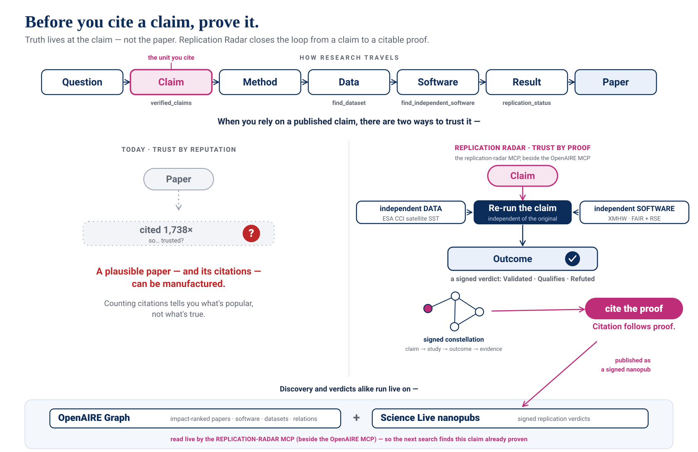

# Before you cite a claim, prove it.

Truth lives at the **claim** — not the paper. Replication Radar makes proof *findable* on the OpenAIRE Graph, and turns a proof into something the next person can **cite**.

<figure class="hero-fig">
  
  <figcaption>Cite the claim, not the paper — and before you cite it, prove it. <b>Citation follows proof.</b></figcaption>
</figure>

## The problem: "cited" no longer means "checked"

A citation was always shorthand for *someone checked this*. That shorthand is breaking. When anyone can generate a plausible paper — and pad it with citations to work it has nothing to do with — counting citations, or walking the citation graph, tells you what is **popular**, not what is **true**.

And a paper is not one thing you can trust: it buries many claims, and what you actually rely on is **one**. When you cite a paper, you're really citing a single claim inside it. So the unit that matters is the claim — and the only honest question is: *has this claim been proven?*

## The shift: soundness is the whole chain, verified

Soundness isn't a property of a paper on its own. It lives in one **verifiable chain** — the claim, the study that tests it, the data behind it, the software that produced it, the evidence that backs it — each link checkable and cryptographically signed. Break any link and the citation means nothing.

So the principle is simple:

> **Before you cite a claim, prove it. Never cite what you haven't verified.**

## What Replication Radar does — the loop

Replication Radar makes that principle operable on the **OpenAIRE Graph**, and closes the loop:

<ol class="loop">
  <li><b>Find what's proven.</b> Search a field and, for each high-impact claim, see whether anyone has independently <em>proven</em> it — a signed Science Live replication verdict (validated · qualifies · refuted), read live from the nanopublication network, author-agnostic. Where the Graph knows only <em>cited / not-cited</em>, the Radar adds <em>checked / not-checked</em>.</li>
  <li><b>If it isn't proven, prove it.</b> The Radar hands you what you need: the <b>independent, reusable software</b> OpenAIRE holds for that field — ranked by signals a one-off deposit can't fake (a resolvable repository · GitHub stars · Software Heritage archival · fair-software.eu + RSE practices: documented · tested · CI · contributing) — and, via the OpenAIRE MCP, <b>independent data</b>. You re-run the claim independent of the original.</li>
  <li><b>Publish the proof.</b> The result is a signed <b>constellation</b> — claim → study → outcome → evidence — not a claim taken on trust.</li>
  <li><b>The loop closes.</b> That constellation becomes part of the Radar: published to the same nanopublication network the Radar reads, so the <b>next</b> person's search finds the claim already proven. <b>Citation follows proof.</b></li>
</ol>

## Research software engineers point to what matters

The signals the Radar checks aren't machine-invented metrics. They are what a **research software engineer — Saranjeet Kaur Bhogal (Imperial College London)** — told us she actually looks for: not a single "FAIR" badge, but whether code is **documented, tested, runs CI, invites contribution**. A human pointed us to what matters; the tool just makes it visible, live, and grounded. We started grading papers; an RSE turned the project around to surfacing the *software* and the engineering behind them.

That reframes everything. Proving a claim needs reusable software, and reusable software is **engineering** — the invisible half of reproducible science, done by people whose work earns the same *"0 citations, class C5"* as an abandoned script. Surfacing and **crediting** that work is part of making proof possible: someone has to build the tool a replication runs on. And the Radar is built to be read by **humans as much as by agents** — a person sees the software behind a claim and whether it's been checked; an agent gets the same signals, grounded, so it can *cite instead of guess*. Machine-actionable, but human-first.

And "human" here is not one kind of person. Every link in the chain is someone's work — the **researcher** who framed the claim, the people who **gathered the data** in the field, the **modeller**, and the **research software engineer** who turned code into a tool others can reuse. Making the chain checkable makes *all of them* visible and creditable. AI **assists** — it finds, connects, drafts, checks — but it doesn't replace any of them. Research isn't human *or* machine, and it isn't one discipline over another: it's all of them **together**, and no one is left out.

A proof needn't stay expert-only, either. Because a constellation is structured and signed, it can be **retold for different audiences** — a plain-language version *for citizens*, another *for schools* — each a signed summary in its own right (attributed as such, never passed off as the record). Verified knowledge that reaches people, not only machines.

## See a real proof

This isn't a mock-up — and it's on the very topic the demo walks through. Here is Oliver et al. 2018, marine heatwaves, **replicated, signed, and Validated** — the thing you'd actually cite:

  <a class="proofcard" href="https://platform-dev.sciencelive4all.org/np/story?uri=https%3A%2F%2Fw3id.org%2Fsciencelive%2Fnp%2FRAQfGMNmJiFt4KDDJE8dsiT3az4CRYehRuDFoa-tXGc8w">
    Read the proof · on Science Live
    Marine heatwaves — independently confirmed
    A signed replication of Oliver et&nbsp;al. (2018): independent satellite SST (ESA&nbsp;CCI) and the independent detector XMHW reproduce the rise in marine-heatwave days <b>to the digit</b> — <b>Validated</b>, and robust to El&nbsp;Niño. The constellation, the verdict, and the same proof retold <b>for citizens</b> and <b>for schools</b>.
    Open the story →
  </a>
  <a class="proofcard alt" href="https://w3id.org/sciencelive/np/RAQfGMNmJiFt4KDDJE8dsiT3az4CRYehRuDFoa-tXGc8w">
    The signed record
    The story nanopublication
    The cryptographically-signed constellation behind the story — claim → study → outcome → evidence, carrying the <b>Validated</b> verdict — resolvable and citable on the nanopublication network. This is what enters the Radar so the next search finds the claim proven.
    Open the nanopub →
  </a>

Also a reproducible <a href="https://annefou.github.io/marine-heatwave-replication/blog/">study blog</a> and open <a href="https://github.com/annefou/marine-heatwave-replication">code + data</a> (Zenodo-archived). And a second proof, in a different field — the <a href="https://platform-dev.sciencelive4all.org/np/story?uri=https%3A%2F%2Fw3id.org%2Fnp%2FRA-5NH-xz4WEtYg6xIAda54W6oQ-I-0uOLQUFinPbMrt8">Sado&nbsp;/&nbsp;Westerschelde estuary replication</a>.

## We closed the loop, end to end

An agent running the Radar *next to the OpenAIRE MCP* took a claim the Radar flags as high-impact but **never replicated** — Oliver et al. 2018, marine heatwaves (~1,740 citations). It **pushed back on our first data choice** — ERA5's sea-surface temperature shares the original paper's HadISST lineage, so it isn't independent — and switched to **independent ESA CCI satellite SST**, detecting events with the independent detector **XMHW**, cross-checked against the author's own tool.

The result is now **published as a signed constellation — and it holds. Validated.** The rise in marine-heatwave days is confirmed (**31.8 days over 1982–2016 against the paper's 30 — within 6%**; frequency and duration agree too; the trend survives ENSO removal), independent in *both* data and code. We keep the scope **honest**: satellite data only reaches back to ~1982, so this validates the **satellite-era** trend and leaves the paper's century-scale "54%" figure explicitly out of scope — no independent pre-1981 daily record exists, for anyone. This is the very replication the demo sets up — now finished, signed, citable, and [retold for citizens and for schools](https://annefou.github.io/marine-heatwave-replication/blog/). Not described: **done.**

## Grounded, and built on the OpenAIRE Graph

Every signal comes from a **named, verifiable source** — the OpenAIRE Graph, the Science Live nanopublication network, GitHub, Software Heritage, Zenodo — documented signal-by-signal in a machine- and human-readable [methodology page](methodology.html). And everything runs **client-side** against public, CORS-enabled APIs — no backend, no keys — so the artifact is a static site anyone can fork, plus a `pip install`-able **MCP server** for any MCP-capable agent, run beside the OpenAIRE MCP — not tied to any one model or vendor. We even deleted a feature we'd built on a guess — it tried to pick the software *relevant* to a topic by matching keywords, and surfaced off-topic repos. Surfacing work has to be **grounded** — from a named source, not a keyword match — or it is just noise. (In its place: rank OpenAIRE's own software index by signals a deposit can't fake, and follow the Graph's own paper→software relations.)

## What others can reuse

- **The live web app** — pure static, queries OpenAIRE + GitHub / Software Heritage / Zenodo + the nanopub network from the browser. Fork it, point it elsewhere.
- **An MCP server** (`pip install replication-radar`) exposing the same engine to any agent, to run alongside the OpenAIRE MCP.
- **A grounded software assessment** — fair-software.eu recommendations *plus* RSE good-practice signals (documented / tested / CI / contributing / code of conduct), computed live from GitHub + Software Heritage + Zenodo.
- **A reproducible, author-agnostic, retraction-aware verdict-index method** — FORRT Outcome / CiTO nanopubs joined on the trusty hash.
- **A machine-readable methodology & provenance spec** (`methodology.json`, CC-BY) — every signal's source and formula.
- **A feasibility map** of which open-science APIs are reachable and CORS-friendly, so the next builder doesn't re-discover it.

*A complementary facet by Jean Iaquinta uses the OpenAIRE MCP's citation-graph tools to show the citation graph holds everything except the verification edge — the gap the Radar fills.*

## Honest limits

Discovery recall is keyword-bound (OpenAIRE free-text terms are AND-ed); the verdict overlay covers whatever the nanopublication network holds, reachable by DOI; the software assessment runs only where a real repository resolves, and GitHub's unauthenticated rate limit caps how many it scores per hour (results are cached). A green CI run is an honest reproducibility *signal* — the code builds and its own tests pass — **not** a claim of independent reproduction, which the replication verdict covers separately. We add two of the missing layers; the full graph of verified knowledge is the direction, not something we finished.

---

*Materials are dual-licensed: **source code under MIT**, and this write-up together with the verdict index and methodology spec under **[CC-BY 4.0](https://creativecommons.org/licenses/by/4.0/)**.*
